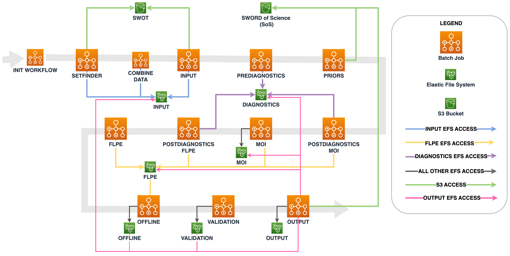

# confluence

## components

Confluence repositories:

- Clean Up: https://github.com/SWOT-Confluence/clean_up
- Combine Data:https://github.com/SWOT-Confluence/combine_data
- Init Workflow: https://github.com/SWOT-Confluence/init_workflow
- Input: https://github.com/SWOT-Confluence/input
- MetroMan: https://github.com/SWOT-Confluence/metroman
- MetroMan Consolidation: https://github.com/SWOT-Confluence/metroman_consolidation
- MOI: https://github.com/SWOT-Confluence/moi
- MOMMA: https://github.com/SWOT-Confluence/momma
- neoBAM: https://github.com/SWOT-Confluence/neobam
- Offline: https://github.com/SWOT-Confluence/offline
- Output: https://github.com/SWOT-Confluence/output
- Postdiagnostics: https://github.com/SWOT-Confluence/postdiagnostics
- Prediagnostics: https://github.com/SWOT-Confluence/prediagnostics
- Priors: https://github.com/SWOT-Confluence/priors
- Report: https://github.com/SWOT-Confluence/report
- SAD: https://github.com/SWOT-Confluence/sad
- Setfinder: https://github.com/SWOT-Confluence/setfinder
- SoS Read: https://github.com/SWOT-Confluence/sos_read
- Validation: https://github.com/SWOT-Confluence/validation

## aws infrastructure

### workflow-infrastructure

The Confluence workflow includes the following AWS service in the `workflow-infrastructure` directory

- AWS Batch compute environment, job queue definitions.
- AWS CloudWatch Logs.
- AWS EFS.
- AWS IAM Roles & Policies.
- AWS S3 SoS Bucket.
- AWS Security Groups and VPC definition.
- AWS System Manager Parameter Store and Key Management Service.

### stepfunction-infrastructure

The Confluence workflow includes the following AWS service in the `stepfunction-infrastructure` directory

- AWS EventBridge rule.
- AWS Step Function state machine.
- AWS IAM Roles & Policies.

## terraform

Deploys AWS infrastructure and stores state in an S3 backend. This top-level terraform repo contains AWS infrastructure that applies to all components. Each component may have additional terraform files for deploying AWS resources, see each components `README.md` for details.

To deploy:

1. Edit `conf.tfvars` for environment to deploy to.
2. Initialize terraform: `terraform init -reconfigure -backend-config="bucket=podaac-services-<env>-terraform" -backend-config="key=services/confluence/confluence.tfstate" -backend-config="region=us-west-2" -backend-config="profile=<named_profile>"`
3. Plan terraform modifications: `terraform plan -var-file="conf.tfvars" -out="tfplan"`
4. Apply terraform modifications: `terraform apply tfplan`

`<env>` can be `sit`, `uat`, or `ops`

`<named_profile>` is the name of the profile used to authenticate to AWS

## docker images

Pulls in SWOT-Confluence container images from `ghcr.io` and pushes them to the Amazon ECR.

*NOTE: This should be run after the Terraform deployment.*

Command line arguments:

- [1] registry: Registry URI
- [2] prefix: Venue deployment prefix
- [3] version: Application version

Example usage: `./delpoy-containers.sh "account-id.dkr.ecr.region.amazonaws.com" "svc-confluence-sit" "1.0.0"`
