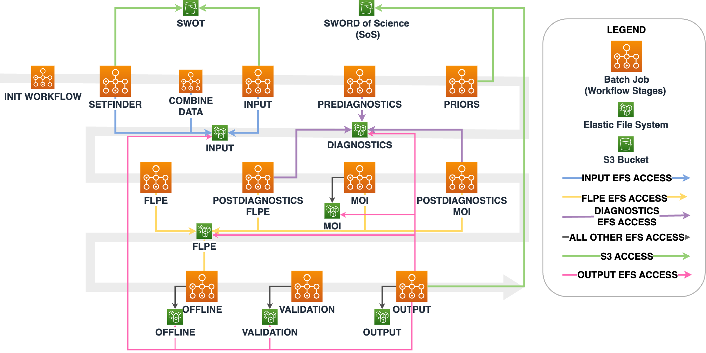

# confluence

## components

-

## aws infrastructure

### workflow-infrastructure

The Confluence workflow includes the following AWS service in the `workflow-infrastructure` directory

- AWS Batch compute environment, job queue definitions.
- AWS CloudWatch Logs.
- AWS EFS.
- AWS IAM Roles & Policies.
- AWS S3 SoS Bucket.
- AWS Security Groups and VPC definition.
- AWS System Manager Parameter Store and Key Management Service.
-

### stepfunction-infrastructure

The Confluence workflow includes the following AWS service in the `stepfunction-infrastructure` directory

- AWS EventBridge rule.
- AWS Step Function state machine.
- AWS IAM Roles & Policies.
-

## terraform

Deploys AWS infrastructure and stores state in an S3 backend. This top-level terraform repo contains AWS infrastructure that applies to all components. Each component may have additional terraform files for deploying AWS resources, see each components `README.md` for details.

To deploy:

1. Edit `conf.tfvars` for environment to deploy to.
2. Initialize terraform: `terraform init -reconfigure -backend-config="bucket=confluence-<env>-tf-state" -backend-config="key=confluence.tfstate" -backend-config="region=us-west-2" -backend-config="profile=<named_profile>"`
3. Plan terraform modifications: `terraform plan -var-file="conf.tfvars" -out="tfplan"`
4. Apply terraform modifications: `terraform apply tfplan`

`<env>` can be `dev1`, `dev2`, `dev3` or `ops`

`<named_profile>` is the name of the profile used to authenticate to AWS

### deployment script

Script to deploy Terraform AWS infrastructure

REQUIRES:
  
- AWS CLI (https://docs.aws.amazon.com/cli/latest/userguide/getting-started-install.html)
- Terraform (https://developer.hashicorp.com/terraform/tutorials/aws-get-started/install-cli)

Command line arguments:

[1] s3_state_bucket: Name of the S3 bucket to store Terraform state in (no need for s3:// prefix)

[2] profile: Name of profile used to authenticate AWS CLI commands

Example usage: `./deploy.sh "s3-state-bucket-name" "confluence-named-profile"`
